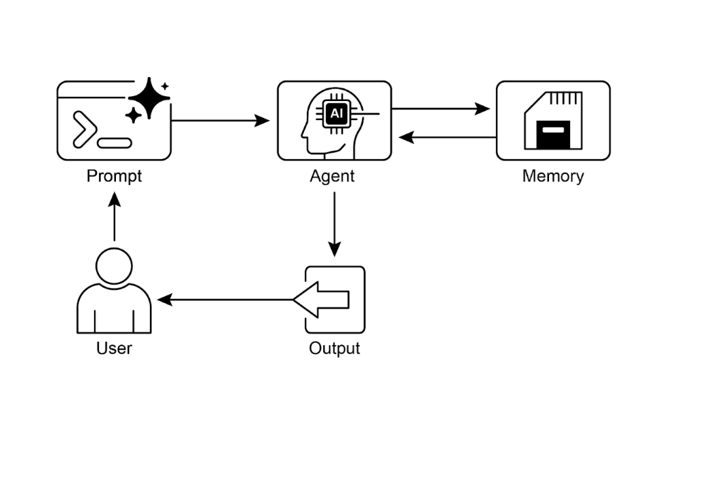

------

# Chapter 8: Memory Management | 

# <mark>第 8 章：记忆管理</mark>

Effective memory management is crucial for intelligent agents to retain information. Agents require different types of memory, much like humans, to operate efficiently. This chapter delves into memory management, specifically addressing the immediate (short-term) and persistent (long-term) memory requirements of agents.

<mark>良好的记忆管理对于智能体保持信息至关重要。与人类类似，智能体需要多种类型的记忆，系统才能高效运行。本章将深入探讨记忆管理，重点聚焦于智能体的即时（短期）和持久（长期）记忆需求。</mark>

In agent systems, memory refers to an agent's ability to retain and utilize information from past interactions, observations, and learning experiences. This capability allows agents to make informed decisions, maintain conversational context, and improve over time. Agent memory is generally categorized into two main types:

<mark>在智能体系统中，**记忆**指的是智能体保留并利用过往交互、观察和学习经验中信息的能力。这一能力使得智能体能够做出明智决策、维持对话上下文语境，并持续改进优化。智能体记忆通常可分为两大主要类型：</mark>

●**Short-Term Memory (Contextual Memory)**: Similar to working memory, this holds information currently being processed or recently accessed. For agents using large language models (LLMs), short-term memory primarily exists within the context window. This window contains recent messages, agent replies, tool usage results, and agent reflections from the current interaction, all of which inform the LLM's subsequent responses and actions. The context window has a limited capacity, restricting the amount of recent information an agent can directly access. Efficient short-term memory management involves keeping the most relevant information within this limited space, possibly through techniques like summarizing older conversation segments or emphasizing key details. The advent of models with 'long context' windows simply expands the size of this short-term memory, allowing more information to be held within a single interaction. However, this context is still ephemeral and is lost once the session concludes, and it can be costly and inefficient to process every time. Consequently, agents require separate memory types to achieve true persistence, recall information from past interactions, and build a lasting knowledge base.

<mark>●**短期记忆（上下文记忆）**：类似于工作记忆，负责存储当前正在处理或近期访问的信息。以大语言模型（LLMs）为核心的智能体，短期记忆主要存在于上下文窗口内。该窗口包含最近的对话消息、智能体生成的回复、工具调用结果以及来自当前交互中智能体的反思内容，所有这些都为 LLM 的后续响应和行动提供上下文支持。上下文窗口的容量有限，从而限制了智能体能够直接访问的近期信息范围。高效的短期记忆管理策略应该选择性地在有限的上下文空间内保留最相关的信息，这可以通过总结旧的对话片段或强调关键细节等技术实现。具有「长上下文」窗口的模型的出现只是扩大了这种短期记忆的容量，从而允许在单次交互中保存更多信息。然而，这种上下文仍然是短暂的，一旦会话结束就会丢失，且每次处理都会带来高昂的成本且本身效率较低。因此，智能体需要不同类型的记忆来实现真正的持久化，从过往交互中回忆信息，并构建持久的知识库。</mark>

●**Long-Term Memory (Persistent Memory)**: This acts as a repository for information agents need to retain across various interactions, tasks, or extended periods, akin to long-term knowledge bases. Data is typically stored outside the agent's immediate processing environment, often in databases, knowledge graphs, or vector databases. In vector databases, information is converted into numerical vectors and stored, enabling agents to retrieve data based on semantic similarity rather than exact keyword matches, a process known as semantic search. When an agent needs information from long-term memory, it queries the external storage, retrieves relevant data, and integrates it into the short-term context for immediate use, thus combining prior knowledge with the current interaction.

<mark>●**长期记忆（持久记忆）**：相当于一个长期知识库，用于存储智能体在各种交互、任务或长时间段内需要保留的信息。数据通常存储在智能体的实时执行环境之外，常见于数据库、知识图谱或向量数据库中。在向量数据库，信息被转换为数值向量并存储，使智能体能够基于语义相似性而非精确关键词匹配来检索数据，这个过程被称为语义搜索。当智能体需要来自长期记忆的信息时，它会查询外部存储、检索相关数据并将其整合到上下文记忆中以供随时调用，从而将先验知识与当前交互信息相结合。</mark>

------

## Practical Applications & Use Cases | <mark>实际应用与使用案例</mark>

Memory management is vital for agents to track information and perform intelligently over time. This is essential for agents to surpass basic question-answering capabilities. Applications include:

<mark>记忆管理对于智能体而言至关重要，它使智能体能够持续追踪信息并在长期运行中展现出智能行为。这一能力是智能体超越基础问答功能、实现更高级智能表现的关键所在。典型应用场景包括：</mark>

●**Chatbots and Conversational AI**: Maintaining conversation flow relies on short-term memory. Chatbots require remembering prior user inputs to provide coherent responses. Long-term memory enables chatbots to recall user preferences, past issues, or prior discussions, offering personalized and continuous interactions.

<mark>●**聊天机器人和对话式 AI**：维持对话流程依赖于短期记忆。聊天机器人需要记住先前的用户输入才能提供连贯的回答。长期记忆使聊天机器人能够调取用户偏好、过往问题或过往对话记录，从而提供个性化且连续一致的交互体验。</mark>

●**Task-Oriented Agents**: Agents managing multi-step tasks need short-term memory to track previous steps, current progress, and overall goals. This information might reside in the task's context or temporary storage. Long-term memory is crucial for accessing specific user-related data not in the immediate context.

<mark>●**任务导向型智能体**：处理多步骤任务的智能体需要借助短期记忆来追踪已完成步骤、当前进度状态及总体目标。这些信息通常存储在任务上下文或临时缓存中。长期记忆对于访问非即时上下文的用户特定数据至关重要。</mark>

●**Personalized Experiences**: Agents offering tailored interactions utilize long-term memory to store and retrieve user preferences, past behaviors, and personal information. This allows agents to adapt their responses and suggestions.

<mark>●**个性化体验服务**：提供定制化交互的智能体利用长期记忆系统来存储和调用用户偏好、历史行为模式及个人信息。这种能力使得智能体能够动态调整其响应策略和建议内容。</mark>

●**Learning and Improvement**: Agents can refine their performance by learning from past interactions. Successful strategies, mistakes, and new information are stored in long-term memory, facilitating future adaptations. Reinforcement learning agents store learned strategies or knowledge in this way.

<mark>●**学习与性能优化**：智能体通过从历史交互中学习来持续改进它的性能表现。成功的策略方案、错误经验以及新获取的知识都被存储在长期记忆中，为未来的自适应优化提供支持。强化学习智能体正是通过这种方式保存习得的策略和知识体系。</mark>

●**Information Retrieval (RAG)**: Agents designed for answering questions access a knowledge base, their long-term memory, often implemented within Retrieval Augmented Generation (RAG). The agent retrieves relevant documents or data to inform its responses.

<mark>●**信息检索（RAG）**：为问答场景设计的智能体需要访问知识库——即长期记忆，这一功能通常在检索增强生成（RAG）框架中实现。智能体通过检索相关文档和数据资源来支撑其回答的准确性和完整性。</mark>

●**Autonomous Systems**: Robots or self-driving cars require memory for maps, routes, object locations, and learned behaviors. This involves short-term memory for immediate surroundings and long-term memory for general environmental knowledge.

<mark>●**自主控制系统**：机器人或自动驾驶车辆需要记忆系统来存储地图信息、导航路线、物体位置以及学习获得的行为模式。这包括用于实时环境感知的短期记忆和用于通用环境知识存储的长期记忆。</mark>

Memory enables agents to maintain history, learn, personalize interactions, and manage complex, time-dependent problems.

<mark>记忆能力使智能体能够维护历史记录、实现持续学习、提供个性化交互，并有效处理复杂的时序依赖性问题。</mark>

------

## Hands-On Code: Memory Management in Google Agent Developer Kit (ADK) | <mark>使用 Google Agent Developer Kit（ADK）的实战代码</mark>

The Google Agent Developer Kit (ADK) offers a structured method for managing context and memory, including components for practical application. A solid grasp of ADK's Session, State, and Memory is vital for building agents that need to retain information.

<mark>Google Agent Developer Kit（ADK）提供了一套结构化的上下文与记忆管理方法，包含多个可直接应用于实际场景的组件。深入理解 ADK 中的会话（Session）、状态（State）和记忆（Memory）三大核心概念，对于构建需要信息持久化能力的智能体至关重要。</mark>

Just as in human interactions, agents require the ability to recall previous exchanges to conduct coherent and natural conversations. ADK simplifies context management through three core concepts and their associated services.

<mark>正如人类之间的交流需要记忆支撑，智能体同样需要具备回忆历史对话的能力，才能进行连贯自然的交流。ADK 通过三个核心概念及其配套服务体系，极大地简化了上下文管理的复杂性。</mark>

Every interaction with an agent can be considered a unique conversation thread. Agents might need to access data from earlier interactions. ADK structures this as follows:

<mark>每次与智能体的交互都可视为一个独立的对话线程，而智能体往往需要访问历史交互数据。ADK 采用如下架构来组织这些信息：</mark>

●**Session**: An individual chat thread that logs messages and actions (Events) for that specific interaction, also storing temporary data (State) relevant to that conversation.

<mark>●**Session（会话）**：一个独立的聊天线程，记录特定交互过程中的消息和执行动作（事件），同时存储与该对话相关的临时数据（状态）。</mark>

●**State (session.state)**: Data stored within a Session, containing information relevant only to the current, active chat thread.

<mark>●**State (session.state) 状态（会话状态）**：存储在会话内部的数据，仅包含与当前活跃聊天线程相关的上下文信息。</mark>

●**Memory**: A searchable repository of information sourced from various past chats or external sources, serving as a resource for data retrieval beyond the immediate conversation.

<mark>●**Memory（记忆）**：一个可检索的信息知识库，数据来源包括历史聊天记录和外部数据源，为超越当前对话范围的数据检索提供支持。</mark>

ADK provides dedicated services for managing critical components essential for building complex, stateful, and context-aware agents. The SessionService manages chat threads (Session objects) by handling their initiation, recording, and termination, while the MemoryService oversees the storage and retrieval of long-term knowledge (Memory).

<mark>ADK 提供专门的服务组件来管理构建复杂、有状态且具备上下文感知能力的智能体所必需的关键要素。SessionService 负责管理聊天线程（Session 对象），处理会话的创建、记录和终止流程，而 MemoryService 主管长期知识（Memory）的存储与检索机制。</mark>

Both the SessionService and MemoryService offer various configuration options, allowing users to choose storage methods based on application needs. In-memory options are available for testing purposes, though data will not persist across restarts. For persistent storage and scalability, ADK also supports database and cloud-based services.

<mark>SessionService 和 MemoryService 均提供多种配置选项，允许开发者根据具体应用需求选择合适的存储方案。内存存储选项适用于测试环境，但数据在重启后不会持久化保存。对于持久化存储方案，ADK 还支持数据库和云服务存储，满足生产环境的持久化需求和可扩展性要求</mark>

------

## Session: Keeping Track of Each Chat | <mark>Session：跟踪每次聊天</mark>

A Session object in ADK is designed to track and manage individual chat threads. Upon initiation of a conversation with an agent, the SessionService generates a Session object, represented as `google.adk.sessions.Session`. This object encapsulates all data relevant to a specific conversation thread, including unique identifiers (id, app_name, user_id), a chronological record of events as Event objects, a storage area for session-specific temporary data known as state, and a timestamp indicating the last update (last_update_time). Developers typically interact with Session objects indirectly through the SessionService. The SessionService is responsible for managing the lifecycle of conversation sessions, which includes initiating new sessions, resuming previous sessions, recording session activity (including state updates), identifying active sessions, and managing the removal of session data. The ADK provides several SessionService implementations with varying storage mechanisms for session history and temporary data, such as the InMemorySessionService, which is suitable for testing but does not provide data persistence across application restarts.

<mark>ADK 中的 Session 对象旨在追踪和管理独立的聊天线程。当与智能体开始对话时，SessionService 会生成一个 Session 对象，表示为 `google.adk.sessions.Session`。该对象封装了特定对话线程的所有相关数据，包括唯一标识符 （`id,app_name,user_id`）、按时间顺序记录的 Event 对象事件、用于会话特定临时数据（称为状态）的存储区域，以及指示最后更新时间的时间戳（`last_update_time`）。开发者通常通过 SessionService 间接与 Session 对象进行交互。SessionService 负责管理对话会话的生命周期，包括启动新会话、恢复先前会话、记录会话活动（含状态更新）、识别活跃会话以及管理会话数据的移除。ADK 提供了多种 SessionService 实现，具有不同的会话历史和临时数据存储机制，例如 InMemorySessionService 适用于测试环境，但无法在应用重启后保持数据持久化。</mark>

```python
# 示例：使用 InMemorySessionService
# 这适用于本地开发和测试，其中不需要跨应用重启的数据持久化。
from google.adk.sessions import InMemorySessionService
session_service = InMemorySessionService()
```

Then there's DatabaseSessionService if you want reliable saving to a database you manage.

<mark>如果你需要将数据可靠地保存到自行管理的数据库中，还可以选择 DatabaseSessionService。</mark>

```python
# 示例：使用 DatabaseSessionService
# 这适用于需要持久存储的生产环境或开发环境。
# 你需要配置数据库 URL（例如，用于 SQLite、PostgreSQL 等）。
# 需要：pip install google-adk[sqlalchemy] 和数据库驱动（例如，PostgreSQL 的 psycopg2）
from google.adk.sessions import DatabaseSessionService
# 使用本地 SQLite 文件的示例：
db_url = "sqlite:///./my_agent_data.db"
session_service = DatabaseSessionService(db_url=db_url)
```

Besides, there's VertexAiSessionService which uses Vertex AI infrastructure for scalable production on Google Cloud.

<mark>此外，还有 VertexAiSessionService，它利用 Vertex AI 基础设施在 Google Cloud 上实现可扩展的生产环境部署。</mark>

```python
# 示例：使用 VertexAiSessionService
# 这适用于 Google Cloud Platform 上的可扩展生产环境，利用 Vertex AI 基础设施进行会话管理。
# 需要：pip install google-adk[vertexai] 以及 GCP 设置/身份验证
from google.adk.sessions import VertexAiSessionService

PROJECT_ID = "your-gcp-project-id" # 替换为你的 GCP 项目 ID
LOCATION = "us-central1" # 替换为你所需的 GCP 位置
# 与此服务一起使用的 app_name 应对应于 Reasoning Engine ID 或名称
REASONING_ENGINE_APP_NAME = "projects/your-gcp-project-id/locations/us-central1/reasoningEngines/your-engine-id" # 替换为你的 Reasoning Engine 资源名称

session_service = VertexAiSessionService(project=PROJECT_ID, location=LOCATION)
# 使用此服务时，将 REASONING_ENGINE_APP_NAME 传递给服务方法：
# session_service.create_session(app_name=REASONING_ENGINE_APP_NAME, ...)
# session_service.get_session(app_name=REASONING_ENGINE_APP_NAME, ...)
# session_service.append_event(session, event, app_name=REASONING_ENGINE_APP_NAME)
# session_service.delete_session(app_name=REASONING_ENGINE_APP_NAME, ...)
```

Choosing an appropriate SessionService is crucial as it determines how the agent's interaction history and temporary data are stored and their persistence.

<mark>选择合适的 SessionService 至关重要，因为它决定了智能体的交互历史和临时数据如何存储及其持久性。</mark>

Each message exchange involves a cyclical process: A message is received, the Runner retrieves or establishes a Session using the SessionService, the agent processes the message using the Session's context (state and historical interactions), the agent generates a response and may update the state, the Runner encapsulates this as an Event, and the session_service.append_event method records the new event and updates the state in storage. The Session then awaits the next message. Ideally, the delete_session method is employed to terminate the session when the interaction concludes. This process illustrates how the SessionService maintains continuity by managing the Session-specific history and temporary data.

<mark>每次消息交换都涉及一个循环过程：接收消息，Runner 使用 SessionService 检索或建立 Session，智能体使用 Session 的上下文（状态和历史交互）处理消息，智能体生成响应并可能更新状态，Runner 将其封装为 Event，`session_service.append_event` 方法记录新事件并在存储中更新状态。然后 Session 等待下一条消息。理想情况下，在交互结束时使用 `delete_session` 方法终止会话。这个过程展示了 SessionService 如何通过管理 Session 特定的历史和临时数据来维持连续性。</mark>

------

## State: The Session's Scratchpad | <mark>State：会话便笺</mark>

In the ADK, each Session, representing a chat thread, includes a state component akin to an agent's temporary working memory for the duration of that specific conversation. While session.events logs the entire chat history, session.state stores and updates dynamic data points relevant to the active chat.

<mark>在 ADK 中，每个代表聊天线程的 Session 都包含一个状态组件，类似于智能体在该特定对话期间的临时工作记忆。虽然 `session.events` 记录整个聊天历史，`session.state` 则负责存储和更新与当前会话相关的动态数据点。</mark>

Fundamentally, session.state operates as a dictionary, storing data as key-value pairs. Its core function is to enable the agent to retain and manage details essential for coherent dialogue, such as user preferences, task progress, incremental data collection, or conditional flags influencing subsequent agent actions.

<mark>从根本上讲，`session.state` 以字典形式运行，通过键值对存储数据。其主要功能是帮助智能体保留和管理对保持对话连贯至关重要的细节，例如用户偏好、任务进展、增量信息收集，或影响后续智能体行为的条件标志。</mark>

The state's structure comprises string keys paired with values of serializable Python types, including strings, numbers, booleans, lists, and dictionaries containing these basic types. State is dynamic, evolving throughout the conversation. The permanence of these changes depends on the configured SessionService.

<mark>状态的结构由字符串键与可序列化的 Python 类型值配对构成，包括字符串、数字、布尔值、列表以及包含这些基本类型的字典。状态是动态变化的，会在整个对话过程中不断演化。这些更改的持久性取决于所配置的 SessionService。</mark>

State organization can be achieved using key prefixes to define data scope and persistence. Keys without prefixes are session-specific.

<mark>可以使用键前缀来定义数据范围和持久性，从而实现状态组织。没有前缀的键是特定于会话的。</mark>

●The **user:** prefix associates data with a user ID across all sessions.

<mark>●**user:** 前缀将数据与用户ID关联，使其在所有会话中保持有效。</mark>

●The **app:** prefix designates data shared among all users of the application.

<mark>●**app:** 前缀标识在应用程序的所有用户之间共享的数据。</mark>

●The **temp:** prefix indicates data valid only for the current processing turn and is not persistently stored.

<mark>●**temp:** 前缀表示仅在当前处理轮次内有效的数据，不会被持久化存储。</mark>

The agent accesses all state data through a single session.state dictionary. The SessionService handles data retrieval, merging, and persistence. State should be updated upon adding an Event to the session history via session_service.append_event(). This ensures accurate tracking, proper saving in persistent services, and safe handling of state changes.

<mark>智能体通过统一的 `session.state` 字典访问所有状态数据。SessionService 负责处理数据的检索、合并和持久化。应在通过 `session_service.append_event()` 向会话历史添加事件时更新状态。这样可以确保准确的跟踪、在持久化服务中的正确保存，以及状态变更的安全处理。</mark>

**1.The Simple Way: Using output_key (for Agent Text Replies):** This is the easiest method if you just want to save your agent's final text response directly into the state. When you set up your LlmAgent, just tell it the output_key you want to use. The Runner sees this and automatically creates the necessary actions to save the response to the state when it appends the event. Let's look at a code example demonstrating state update via output_key.

<mark>**1. 简单方法：使用 output_key（用于智能体文本回复）：**如果你只需将智能体的最终文本响应直接保存到状态中，这是最简单的方法。配置 `LlmAgent` 时，只需指定要使用的 `output_key`。Runner 会识别此设置，并在附加事件时自动创建必要的操作来将响应保存到状态中。我们来看一个通过 `output_key` 实现状态更新的代码示例。</mark>

```python
# 从 Google Agent Developer Kit（ADK）导入必要的类
from google.adk.agents import LlmAgent
from google.adk.sessions import InMemorySessionService, Session
from google.adk.runners import Runner
from google.genai.types import Content, Part

# 定义一个带有 output_key 的 LlmAgent。
greeting_agent = LlmAgent(
   name="Greeter",
   model="gemini-2.0-flash",
   instruction="生成一个简短、友好的问候语。",
   output_key="last_greeting"
)

# --- 设置 Runner 和 Session ---
app_name, user_id, session_id = "state_app", "user1", "session1"
session_service = InMemorySessionService()
runner = Runner(
   agent=greeting_agent,
   app_name=app_name,
   session_service=session_service
)
session = session_service.create_session(
   app_name=app_name,
   user_id=user_id,
   session_id=session_id
)

print(f"初始状态: {session.state}")

# --- 运行智能体 ---
user_message = Content(parts=[Part(text="你好")])
print("\n--- 运行智能体 ---")
for event in runner.run(
   user_id=user_id,
   session_id=session_id,
   new_message=user_message
):
   if event.is_final_response():
     print("智能体已响应。")

# --- 检查更新后的状态 ---
# 在 runner 完成处理所有事件后正确检查状态。
updated_session = session_service.get_session(app_name, user_id, session_id)
print(f"\n智能体运行后的状态: {updated_session.state}")
```

Behind the scenes, the Runner sees your output_key and automatically creates the necessary actions with a state_delta when it calls append_event.

<mark>在后台，Runner 会识别你的 `output_key`，并在调用 `append_event` 时自动创建带有 `state_delta` 的必要操作。</mark>

**2.The Standard Way: Using EventActions.state_delta (for More Complicated Updates):** For times when you need to do more complex things – like updating several keys at once, saving things that aren't just text, targeting specific scopes like user: or app:, or making updates that aren't tied to the agent's final text reply – you'll manually build a dictionary of your state changes (the state_delta) and include it within the EventActions of the Event you're appending. Let's look at one example:

<mark>**2. 标准方法：使用 EventActions.state_delta（用于更复杂的更新）：**当你需要进行更复杂的操作时——例如同时更新多个键、保存非纯文本内容、针对特定作用域（如 `user:` 或 `app:`），或者执行与智能体最终文本回复无关的更新——你需要手动构建状态变更的字典（即 `state_delta`），并将其包含在要附加的 Event 的 EventActions 中。让我们来看一个示例：</mark>

```python
import time
from google.adk.tools.tool_context import ToolContext
from google.adk.sessions import InMemorySessionService

# --- 定义推荐的基于工具的方法 ---
def log_user_login(tool_context: ToolContext) -> dict:
   """
   在用户登录事件时更新会话状态。
   此工具封装了与用户登录相关的所有状态更改。
   参数：
       tool_context：由 ADK 自动提供，提供对会话状态的访问。
   返回：
       确认操作成功的字典。
   """
   # 通过提供的上下文直接访问状态。
   state = tool_context.state
  
   # 获取当前值或默认值，然后更新状态。
   # 这更清晰，并且将逻辑集中在一起。
   login_count = state.get("user:login_count", 0) + 1
   state["user:login_count"] = login_count
   state["task_status"] = "active"
   state["user:last_login_ts"] = time.time()
   state["temp:validation_needed"] = True
  
   print("从 `log_user_login` 工具内部更新了状态。")
  
   return {
       "status": "success",
       "message": f"已跟踪用户登录。总登录次数：{login_count}。"
   }

# --- 使用演示 ---
# 在实际应用中，LLM 智能体会决定调用此工具。
# 在这里，我们模拟直接调用以进行演示。

# 1. 设置
session_service = InMemorySessionService()
app_name, user_id, session_id = "state_app_tool", "user3", "session3"
session = session_service.create_session(
   app_name=app_name,
   user_id=user_id,
   session_id=session_id,
   state={"user:login_count": 0, "task_status": "idle"}
)
print(f"初始状态: {session.state}")

# 2. 模拟工具调用（在实际应用中，ADK Runner 执行此操作）
# 我们手动创建一个 ToolContext 仅用于此独立示例。
from google.adk.tools.tool_context import InvocationContext
mock_context = ToolContext(
   invocation_context=InvocationContext(
       app_name=app_name, user_id=user_id, session_id=session_id,
       session=session, session_service=session_service
   )
)

# 3. 执行工具
log_user_login(mock_context)

# 4. 检查更新后的状态
updated_session = session_service.get_session(app_name, user_id, session_id)
print(f"工具执行后的状态: {updated_session.state}")

# 预期输出将显示与之前情况相同的状态更改，
# 但代码组织明显更清晰、更稳健。
```

This code demonstrates a tool-based approach for managing user session state in an application. It defines a function log_user_login, which acts as a tool. This tool is responsible for updating the session state when a user logs in.

<mark>此代码演示了一种基于工具的方法来管理应用程序中的用户会话状态。它定义了一个函数 `log_user_login`，该函数充当工具角色。此工具负责在用户登录时更新会话状态。</mark>

The function takes a ToolContext object, provided by the ADK, to access and modify the session's state dictionary. Inside the tool, it increments a user:login_count, sets the task_status to "active", records the user:last_login_ts (timestamp), and adds a temporary flag temp:validation_needed.

<mark>该函数接收由 ADK 提供的 `ToolContext` 对象，用于访问和修改会话的状态字典。在工具内部，它会递增 `user:login_count`，将 `task_status` 设置为 `active`，记录 `user:last_login_ts`（时间戳），并添加临时标志 `temp:validation_needed`。</mark>

The demonstration part of the code simulates how this tool would be used. It sets up an in-memory session service and creates an initial session with some predefined state. A ToolContext is then manually created to mimic the environment in which the ADK Runner would execute the tool. The log_user_login function is called with this mock context. Finally, the code retrieves the session again to show that the state has been updated by the tool's execution. The goal is to show how encapsulating state changes within tools makes the code cleaner and more organized compared to directly manipulating state outside of tools.

<mark>代码的演示部分模拟了此工具的使用方式。它设置了一个内存会话服务，并创建了一个包含预定义状态的初始会话。随后手动创建 `ToolContext` 来模拟 ADK Runner 执行工具的环境。使用此模拟上下文调用 `log_user_login` 函数。最后，代码再次检索会话以展示状态已通过工具执行而更新。其目的是展示与在工具外部直接操作状态相比，将状态变更封装在工具内部如何使代码更加清晰和有条理。</mark>

Note that direct modification of the `session.state` dictionary after retrieving a session is strongly discouraged as it bypasses the standard event processing mechanism. Such direct changes will not be recorded in the session's event history, may not be persisted by the selected `SessionService`, could lead to concurrency issues, and will not update essential metadata such as timestamps. The recommended methods for updating the session state are using the `output_key` parameter on an `LlmAgent` (specifically for the agent's final text responses) or including state changes within `EventActions.state_delta` when appending an event via `session_service.append_event()`. The `session.state` should primarily be used for reading existing data.

<mark>请注意，强烈不建议在检索会话后直接修改 `session.state` 字典，因为这会绕过标准的事件处理机制。此类直接更改不会被记录在会话的事件历史中，可能无法被所选 `SessionService` 持久化存储，可能引起并发问题，并且不会更新时间戳等关键元数据。更新会话状态的推荐方法包括：在 `LlmAgent` 上使用 `output_key` 参数（专门用于智能体的最终文本响应），或在通过 `session_service.append_event()` 附加事件时，在 `EventActions.state_delta` 中包含状态变更。`session.state` 应主要用于读取现有数据。</mark>

To recap, when designing your state, keep it simple, use basic data types, give your keys clear names and use prefixes correctly, avoid deep nesting, and always update state using the append_event process.

<mark>总而言之，在设计状态时，应保持简洁，使用基本数据类型，为键赋予清晰的名称并正确使用前缀，避免深度嵌套，并始终通过 `append_event` 流程来更新状态。</mark>

------

## Memory: Long-Term Knowledge with MemoryService | <mark>Memory：使用 MemoryService 进行长期知识管理</mark>

In agent systems, the Session component maintains a record of the current chat history (events) and temporary data (state) specific to a single conversation. However, for agents to retain information across multiple interactions or access external data, long-term knowledge management is necessary. This is facilitated by the MemoryService.

<mark>在智能体系统中，Session 组件负责维护特定于单个对话的当前聊天历史记录（事件）和临时数据（状态）。然而，为了让智能体能够在多次交互中持久保存信息或访问外部数据，需要实现长期知识管理功能。这一功能由 MemoryService 提供支持。</mark>

```python
# 示例：使用 InMemoryMemoryService
# 这适用于本地开发和测试，其中不需要跨应用重启的数据持久化。
# 应用停止时记忆内容会丢失。
from google.adk.memory import InMemoryMemoryService
memory_service = InMemoryMemoryService()
```

Session and State can be conceptualized as short-term memory for a single chat session, whereas the Long-Term Knowledge managed by the MemoryService functions as a persistent and searchable repository. This repository may contain information from multiple past interactions or external sources. The MemoryService, as defined by the BaseMemoryService interface, establishes a standard for managing this searchable, long-term knowledge. Its primary functions include adding information, which involves extracting content from a session and storing it using the add_session_to_memory method, and retrieving information, which allows an agent to query the store and receive relevant data using the search_memory method.

<mark>Session 和 State 可被概念化为单个聊天会话的短期记忆，而由 MemoryService 管理的长期知识则充当持久化且可搜索的知识库。该知识库可能包含来自多次历史交互或外部数据源的信息。MemoryService 通过 `BaseMemoryService` 接口定义，为管理这种可搜索的长期知识建立了标准化规范。其主要功能包括信息添加（涉及从会话中提取内容并使用 `add_session_to_memory` 方法进行存储）和信息检索（允许智能体查询存储库并使用 `search_memory` 方法获取相关数据）。</mark>

The ADK offers several implementations for creating this long-term knowledge store. The InMemoryMemoryService provides a temporary storage solution suitable for testing purposes, but data is not preserved across application restarts. For production environments, the VertexAiRagMemoryService is typically utilized. This service leverages Google Cloud's Retrieval Augmented Generation (RAG) service, enabling scalable, persistent, and semantic search capabilities (Also, refer to the chapter 14 on RAG).

<mark>ADK 提供了多种实现方案来创建这种长期知识存储。`InMemoryMemoryService` 提供适用于测试目的的临时存储解决方案，但其数据在应用程序重启后不会保留。对于生产环境，通常采用 `VertexAiRagMemoryService`。该服务利用 Google Cloud 的检索增强生成（RAG）服务，提供可扩展、持久化且支持语义搜索的能力（有关 RAG 的详细信息，请参阅第 14 章）。</mark>

```python
# 示例：使用 VertexAiRagMemoryService
# 这适用于 GCP 上的可扩展生产环境，利用 Vertex AI RAG（检索增强生成）实现持久、可搜索的记忆。
# 需要：pip install google-adk[vertexai]、GCP 设置/身份验证，以及 Vertex AI RAG Corpus。
from google.adk.memory import VertexAiRagMemoryService

# 你的 Vertex AI RAG Corpus 的资源名称
RAG_CORPUS_RESOURCE_NAME = "projects/your-gcp-project-id/locations/us-central1/ragCorpora/your-corpus-id" # 替换为你的 Corpus 资源名称

# 检索行为的可选配置
SIMILARITY_TOP_K = 5 # 要检索的顶部结果数量
VECTOR_DISTANCE_THRESHOLD = 0.7 # 向量相似性的阈值

memory_service = VertexAiRagMemoryService(
   rag_corpus=RAG_CORPUS_RESOURCE_NAME,
   similarity_top_k=SIMILARITY_TOP_K,
   vector_distance_threshold=VECTOR_DISTANCE_THRESHOLD
)
# 使用此服务时，add_session_to_memory 和 search_memory 等方法将与指定的 Vertex AI RAG Corpus 交互。
```

------

## Hands-on code: Memory Management in LangChain and LangGraph | <mark>使用 LangChain 和 LangGraph 的实战代码</mark>

In LangChain and LangGraph, Memory is a critical component for creating intelligent and natural-feeling conversational applications. It allows an AI agent to remember information from past interactions, learn from feedback, and adapt to user preferences. LangChain's memory feature provides the foundation for this by referencing a stored history to enrich current prompts and then recording the latest exchange for future use. As agents handle more complex tasks, this capability becomes essential for both efficiency and user satisfaction.

<mark>在 LangChain 和 LangGraph 中，记忆是创建智能且具有自然感的对话应用程序的关键组件。它使 AI 智能体能够记住过往交互的信息、从反馈中学习并适应用户偏好。LangChain 的记忆功能通过引用存储的历史记录来丰富当前提示词，然后记录最新的交互内容以供将来使用，为此奠定了基础。随着智能体处理更复杂的任务，这种能力对于提升效率和用户满意度都变得至关重要。</mark>

**Short-Term Memory:** This is thread-scoped, meaning it tracks the ongoing conversation within a single session or thread. It provides immediate context, but a full history can challenge an LLM's context window, potentially leading to errors or poor performance. LangGraph manages short-term memory as part of the agent's state, which is persisted via a checkpointer, allowing a thread to be resumed at any time.

<mark>**短期记忆：**这是线程作用域的，意味着它在单个会话或线程内跟踪正在进行的对话。它提供即时上下文，但完整的历史记录会挑战 LLM 的上下文窗口限制，随之可能导致错误或性能下降。LangGraph 将短期记忆作为智能体状态的一部分进行管理，通过检查点机制实现持久化，允许随时恢复线程执行。</mark>

**Long-Term Memory:** This stores user-specific or application-level data across sessions and is shared between conversational threads. It is saved in custom "namespaces" and can be recalled at any time in any thread. LangGraph provides stores to save and recall long-term memories, enabling agents to retain knowledge indefinitely.

<mark>**长期记忆：**这是跨会话存储用户特定或应用程序级别的数据，并在对话线程之间共享。它保存在自定义的「命名空间」中，可以在任何线程的任何时间被召回。LangGraph 提供了存储机制来保存和召回长期记忆，使智能体能够无限期地保留知识。</mark>

LangChain provides several tools for managing conversation history, ranging from manual control to automated integration within chains.

<mark>LangChain 提供了多种工具来管理对话历史，涵盖从手动控制到链内自动集成的各种场景。</mark>

**ChatMessageHistory: Manual Memory Management.** For direct and simple control over a conversation's history outside of a formal chain, the ChatMessageHistory class is ideal. It allows for the manual tracking of dialogue exchanges.

<mark>**ChatMessageHistory：手动记忆管理。**对于在正式链之外直接而简单地控制对话历史，`ChatMessageHistory` 类是理想选择。它支持手动跟踪对话交换过程。</mark>

```python
from langchain.memory import ChatMessageHistory

# 初始化历史对象
history = ChatMessageHistory()

# 添加用户和 AI 消息
history.add_user_message("我下周要去纽约。")
history.add_ai_message("太好了！这是一个很棒的城市。")

# 访问消息列表
print(history.messages)
```

**ConversationBufferMemory: Automated Memory for Chains.** For integrating memory directly into chains, ConversationBufferMemory is a common choice. It holds a buffer of the conversation and makes it available to your prompt. Its behavior can be customized with two key parameters:

<mark>**ConversationBufferMemory：链的自动化记忆管理。**对于将记忆功能直接集成到链中的场景，`ConversationBufferMemory` 是一个常用的选择。它维护对话内容的缓冲区，并将其提供给提示词使用。其行为可以通过两个关键参数进行自定义配置：</mark>

●**memory_key**: A string that specifies the variable name in your prompt that will hold the chat history. It defaults to "history".

<mark>●**memory_key**：一个字符串参数，用于指定提示词模板中存储聊天历史的变量名称。默认值为"history"。</mark>

●**return_messages**: A boolean that dictates the format of the history. ○If False (the default), it returns a single formatted string, which is ideal for standard LLMs. ○If True, it returns a list of message objects, which is the recommended format for Chat Models.

<mark>●**return_messages**：一个布尔值参数，用于控制历史记录的返回格式。 ○如果设置为 False（默认值），则返回单个格式化字符串，这适用于标准的 LLM 模型。 ○如果设置为 True，则返回消息对象列表，这是聊天模型的推荐格式。</mark>

```python
from langchain.memory import ConversationBufferMemory

# 初始化记忆
memory = ConversationBufferMemory()

# 保存对话轮次
memory.save_context({"input": "天气怎么样？"}, {"output": "今天是晴天。"})

# 将记忆加载为字符串
print(memory.load_memory_variables({}))
```

Integrating this memory into an LLMChain allows the model to access the conversation's history and provide contextually relevant responses

<mark>将此记忆功能集成到 `LLMChain` 中，使得模型能够访问对话的历史记录并提供与上下文相关的响应</mark>

```python
from langchain_openai import OpenAI
from langchain.chains import LLMChain
from langchain.prompts import PromptTemplate
from langchain.memory import ConversationBufferMemory

# 1. 定义 LLM 和提示
llm = OpenAI(temperature=0)
template = """你是一个有帮助的旅行代理。

先前的对话：
{history}

新问题：{question}
回复："""
prompt = PromptTemplate.from_template(template)

# 2. 配置记忆
# memory_key "history" 与提示中的变量匹配
memory = ConversationBufferMemory(memory_key="history")

# 3. 构建链
conversation = LLMChain(llm=llm, prompt=prompt, memory=memory)

# 4. 运行对话
response = conversation.predict(question="我想预订航班。")
print(response)
response = conversation.predict(question="顺便说一下，我叫 Sam。")
print(response)
response = conversation.predict(question="我的名字又是什么？")
print(response)
```

For improved effectiveness with chat models, it is recommended to use a structured list of message objects by setting `return_messages=True`.

<mark>为了提高聊天模型的有效性，建议通过设置 `return_messages=True` 来使用结构化的消息对象列表。</mark>

```python
<mark>from langchain_openai import ChatOpenAI
from langchain.chains import LLMChain
from langchain.memory import ConversationBufferMemory
from langchain_core.prompts import (
   ChatPromptTemplate,
   MessagesPlaceholder,
   SystemMessagePromptTemplate,
   HumanMessagePromptTemplate,
)

# 1. 定义聊天模型和提示
llm = ChatOpenAI()
prompt = ChatPromptTemplate(
   messages=[
       SystemMessagePromptTemplate.from_template("你是一个友好的助手。"),
       MessagesPlaceholder(variable_name="chat_history"),
       HumanMessagePromptTemplate.from_template("{question}")
   ]
)

# 2. 配置记忆
# return_messages=True 对聊天模型来说至关重要
memory = ConversationBufferMemory(memory_key="chat_history", return_messages=True)

# 3. 构建链
conversation = LLMChain(llm=llm, prompt=prompt, memory=memory)

# 4. 运行对话
response = conversation.predict(question="你好，我是 Jane。")
print(response)
response = conversation.predict(question="你还记得我的名字吗？")
print(response)
```

**Types of Long-Term Memory:** Long-term memory allows systems to retain information across different conversations, providing a deeper level of context and personalization. It can be broken down into three types analogous to human memory:

<mark>**长期记忆的类型：**长期记忆使系统能够在不同对话会话间持久保存信息，提供更深层次的上下文理解能力和个性化服务。它可以类比人类记忆机制分为以下三种类型：</mark>

●**Semantic Memory: Remembering Facts:** This involves retaining specific facts and concepts, such as user preferences or domain knowledge. It is used to ground an agent's responses, leading to more personalized and relevant interactions. This information can be managed as a continuously updated user "profile" (a JSON document) or as a "collection" of individual factual documents.

<mark>●**语义记忆：事实记忆：**这涉及持久化存储具体的事实信息和概念知识，例如用户偏好设置或领域专业知识。它为智能体的响应提供事实依据，从而实现更加个性化和情境相关的交互体验。这类信息可以作为持续更新的用户「档案」（JSON格式文档）或作为独立事实文档的「集合」进行管理。</mark>

●**Episodic Memory: Remembering Experiences:** This involves recalling past events or actions. For AI agents, episodic memory is often used to remember how to accomplish a task. In practice, it's frequently implemented through few-shot example prompting, where an agent learns from past successful interaction sequences to perform tasks correctly.

<mark>●**情景记忆：经历记忆：**这涉及对过往事件或行为序列的回忆和重构。对于AI智能体而言，情景记忆通常用于记忆如何完成特定任务。在实践中，常通过少样本示例提示机制实现，智能体从历史成功的交互序列中学习经验，以正确执行复杂任务。</mark>

●**Procedural Memory: Remembering Rules:** This is the memory of how to perform tasks—the agent's core instructions and behaviors, often contained in its system prompt. It's common for agents to modify their own prompts to adapt and improve. An effective technique is "Reflection," where an agent is prompted with its current instructions and recent interactions, then asked to refine its own instructions.

<mark>●**程序记忆：规则记忆：**这是关于如何执行任务的操作性记忆——包含智能体的核心指令集和行为规范，通常体现在系统提示词中。智能体通过修改自身提示词来实现自适应和改进是常见做法。一种高效的技术是「反思机制」，即向智能体呈现当前指令和近期交互记录，要求其自主优化和完善指令内容。</mark>

Below is pseudo-code demonstrating how an agent might use reflection to update its procedural memory stored in a LangGraph BaseStore

<mark>以下是伪代码示例，演示智能体如何运用反思机制来更新存储在LangGraph `BaseStore`中的程序记忆</mark>

```python
# 更新智能体指令的节点
def update_instructions(state: State, store: BaseStore):
   namespace = ("instructions",)
   # 从存储中获取当前指令
   current_instructions = store.search(namespace)[0]
  
   # 创建提示以要求 LLM 反思对话并生成新的改进指令
   prompt = prompt_template.format(
       instructions=current_instructions.value["instructions"],
       conversation=state["messages"]
   )
  
   # 从 LLM 获取新指令
   output = llm.invoke(prompt)
   new_instructions = output['new_instructions']
  
   # 将更新后的指令保存回存储
   store.put(("agent_instructions",), "agent_a", {"instructions": new_instructions})

# 使用指令生成响应的节点
def call_model(state: State, store: BaseStore):
   namespace = ("agent_instructions", )
   # 从存储中检索最新指令
   instructions = store.get(namespace, key="agent_a")[0]
  
   # 使用检索到的指令格式化提示
   prompt = prompt_template.format(instructions=instructions.value["instructions"])
   # ... 应用逻辑继续
```

LangGraph stores long-term memories as JSON documents in a store. Each memory is organized under a custom namespace (like a folder) and a distinct key (like a filename). This hierarchical structure allows for easy organization and retrieval of information. The following code demonstrates how to use InMemoryStore to put, get, and search for memories.

<mark>LangGraph 将长期记忆以 JSON 文档格式存储在存储系统中。每个记忆条目都在自定义命名空间（类似于文件夹结构）和唯一键名（类似于文件名）下进行组织管理。这种层次化的存储结构便于信息的系统化组织和高效检索。以下代码示例演示了如何使用 `InMemoryStore` 来实现记忆的存储、获取和搜索操作。</mark>

```python
from langgraph.store.memory import InMemoryStore

# 实际嵌入函数的占位符
def embed(texts: list[str]) -> list[list[float]]:
   # 在实际应用中，使用适当的嵌入模型
   return [[1.0, 2.0] for _ in texts]

# 初始化内存存储。对于生产环境，使用基于数据库的存储。
store = InMemoryStore(index={"embed": embed, "dims": 2})

# 为特定用户和应用上下文定义命名空间
user_id = "my-user"
application_context = "chitchat"
namespace = (user_id, application_context)

# 1. 将记忆放入存储
store.put(
   namespace,
   "a-memory",  # 此记忆的键
   {
       "rules": [
           "用户喜欢简短、直接的语言",
           "用户只会说英语和 python",
       ],
       "my-key": "my-value",
   },
)

# 2. 通过其命名空间和键获取记忆
item = store.get(namespace, "a-memory")
print("检索到的项目：", item)

# 3. 在命名空间内搜索记忆，按内容过滤并按与查询的向量相似性排序。
items = store.search(
   namespace,
   filter={"my-key": "my-value"},
   query="语言偏好"
)
print("搜索结果：", items)
```

------

## Vertex Memory Bank | <mark>Vertex Memory Bank</mark>

Memory Bank, a managed service in the Vertex AI Agent Engine, provides agents with persistent, long-term memory. The service uses Gemini models to asynchronously analyze conversation histories to extract key facts and user preferences.

<mark>Memory Bank 是 Vertex AI Agent Engine 中的一项托管服务，为智能体提供持久化的长期记忆能力。该服务利用 Gemini 模型对对话历史进行异步分析，从中提取关键事实信息和用户偏好数据。</mark>

This information is stored persistently, organized by a defined scope like user ID, and intelligently updated to consolidate new data and resolve contradictions. Upon starting a new session, the agent retrieves relevant memories through either a full data recall or a similarity search using embeddings. This process allows an agent to maintain continuity across sessions and personalize responses based on recalled information.

<mark>这些信息被持久化存储，按照预定义的范围（如用户 ID）进行组织管理，并通过智能更新机制来整合新数据和解决信息矛盾。当启动新会话时，智能体通过完整数据召回或基于嵌入向量的相似性搜索来检索相关记忆内容。这一流程使智能体能够维持跨会话的连续性，并根据检索到的记忆信息提供个性化响应。</mark>

The agent's runner interacts with the VertexAiMemoryBankService, which is initialized first. This service handles the automatic storage of memories generated during the agent's conversations. Each memory is tagged with a unique USER_ID and APP_NAME, ensuring accurate retrieval in the future.

<mark>智能体的运行器与预先初始化的 `VertexAiMemoryBankService` 服务进行交互。该服务负责自动存储智能体在对话过程中生成的记忆内容。每个记忆条目都通过唯一的 `USER_ID` 和 `APP_NAME` 进行标记，确保未来能够准确检索。</mark>

```python
from google.adk.memory import VertexAiMemoryBankService

agent_engine_id = agent_engine.api_resource.name.split("/")[-1]

memory_service = VertexAiMemoryBankService(
   project="PROJECT_ID",
   location="LOCATION",
   agent_engine_id=agent_engine_id
)

session = await session_service.get_session(
   app_name=app_name,
   user_id="USER_ID",
   session_id=session.id
)
await memory_service.add_session_to_memory(session)
```

Memory Bank offers seamless integration with the Google ADK, providing an immediate out-of-the-box experience. For users of other agent frameworks, such as LangGraph and CrewAI, Memory Bank also offers support through direct API calls. Online code examples demonstrating these integrations are readily available for interested readers.

<mark>Memory Bank 与 Google ADK（代理开发工具包）提供无缝集成能力，支持即开即用的开箱即用体验。对于其他智能体框架（如 LangGraph 和 CrewAI）的用户，Memory Bank 也通过直接 API 调用的方式提供兼容支持。感兴趣的读者可以轻松获取展示这些集成方案的在线代码示例。</mark>

------

## At a Glance | 要点速览

**What:** Agentic systems need to remember information from past interactions to perform complex tasks and provide coherent experiences. Without a memory mechanism, agents are stateless, unable to maintain conversational context, learn from experience, or personalize responses for users. This fundamentally limits them to simple, one-shot interactions, failing to handle multi-step processes or evolving user needs. The core problem is how to effectively manage both the immediate, temporary information of a single conversation and the vast, persistent knowledge gathered over time.

<mark>**问题所在：**智能体系统需要记住过往交互的信息以执行复杂任务并提供连贯的体验。如果没有记忆机制，智能体就是无状态的，无法维持对话上下文、从经验中学习或为用户个性化响应。这从根本上将它们限制在简单的一次性交互中，无法处理多步骤流程或不断变化的用户需求。核心问题是如何有效管理单次对话的即时临时信息和随时间收集的大量持久知识。</mark>

**Why:** The standardized solution is to implement a dual-component memory system that distinguishes between short-term and long-term storage. Short-term, contextual memory holds recent interaction data within the LLM's context window to maintain conversational flow. For information that must persist, long-term memory solutions use external databases, often vector stores, for efficient, semantic retrieval. Agentic frameworks like the Google ADK provide specific components to manage this, such as Session for the conversation thread and State for its temporary data. A dedicated MemoryService is used to interface with the long-term knowledge base, allowing the agent to retrieve and incorporate relevant past information into its current context.

<mark>**解决之道：**标准化解决方案是实现一个双组件记忆系统，区分短期和长期存储。短期的上下文记忆在 LLM 的上下文窗口内保存最近的交互数据以维持对话流程。对于必须持久化的信息，长期记忆解决方案使用外部数据库（通常是向量存储）进行高效的语义检索。像 Google ADK 这样的智能体框架提供特定组件来管理这一点，例如用于对话线程的 Session 和用于其临时数据的 State。专门的 MemoryService 用于与长期知识库接口，允许智能体检索相关的过去信息并将其整合到其当前上下文中。</mark>

**Rule of thumb:** Use this pattern when an agent needs to do more than answer a single question. It is essential for agents that must maintain context throughout a conversation, track progress in multi-step tasks, or personalize interactions by recalling user preferences and history. Implement memory management whenever the agent is expected to learn or adapt based on past successes, failures, or newly acquired information.

<mark>**经验法则：**当智能体需要执行超越单一问题回答的复杂任务时，建议采用此类模式。对于必须在整个对话中维持上下文、跟踪多步骤任务中的进度或通过回忆用户偏好和历史来个性化交互的智能体来说，这类模式也是必不可少的。当智能体需要基于过去的成功、失败或新获得的信息进行学习或自适应调整时，就需要进行实施记忆管理。</mark>

**Visual summary**

<mark>**可视化总结**</mark>



Fig.1: Memory management design pattern

<mark>**图 1：**记忆管理设计模式</mark>

------

## Key Takeaways | <mark>核心要点</mark>

To quickly recap the main points about memory management:

<mark>快速回顾记忆管理的核心要点：</mark>

●Memory is super important for agents to keep track of things, learn, and personalize interactions.

<mark>●记忆机制对于智能体的事件追踪、经验学习和个性化交互至关重要。</mark>

●Conversational AI relies on both short-term memory for immediate context within a single chat and long-term memory for persistent knowledge across multiple sessions.

<mark>●对话式 AI 系统同时依赖短期记忆（管理单次聊天中的即时上下文）和长期记忆（维护跨多个会话的持久化知识）。</mark>

●Short-term memory (the immediate stuff) is temporary, often limited by the LLM's context window or how the framework passes context.

<mark>●短期记忆（处理即时内容）具有临时性，通常受限于 LLM 的上下文窗口容量或框架的上下文传递机制。</mark>

●Long-term memory (the stuff that sticks around) saves info across different chats using outside storage like vector databases and is accessed by searching.

<mark>●长期记忆（存储持久化内容）利用外部存储系统（如向量数据库）在不同聊天会话间保存信息，并通过搜索机制进行访问。</mark>

●Frameworks like ADK have specific parts like Session (the chat thread), State (temporary chat data), and MemoryService (the searchable long-term knowledge) to manage memory.

<mark>●诸如 ADK 之类的框架通过特定组件管理记忆：Session（管理聊天线程）、State（存储临时聊天数据）和 MemoryService（提供可搜索的长期知识库）。</mark>

●ADK's SessionService handles the whole life of a chat session, including its history (events) and temporary data (state).

<mark>●ADK 的 SessionService 负责管理聊天会话的完整生命周期，包括历史记录（事件日志）和临时数据（状态信息）。</mark>

●ADK's session.state is a dictionary for temporary chat data. Prefixes (user:, app:, temp:) tell you where the data belongs and if it sticks around.

<mark>●ADK 的 `session.state` 是一个用于存储临时聊天数据的字典结构。前缀标识符（`user:`,`app:`,`temp:`）明确数据归属范围及其持久化特性。</mark>

●In ADK, you should update state by using EventActions.state_delta or output_key when adding events, not by changing the state dictionary directly.

<mark>●在 ADK 框架中，状态更新应通过 `EventActions.state_delta` 或 `output_key` 在添加事件时进行，而非直接修改状态字典。</mark>

●ADK's MemoryService is for putting info into long-term storage and letting agents search it, often using tools.

<mark>●ADK 的 MemoryService 专用于将信息存入长期存储系统，并支持智能体通过工具接口进行搜索检索。</mark>

●LangChain offers practical tools like ConversationBufferMemory to automatically inject the history of a single conversation into a prompt, enabling an agent to recall immediate context.

<mark>●LangChain 提供诸如 `ConversationBufferMemory` 等实用工具，能够自动将单次对话历史注入提示词中，使智能体具备即时上下文回忆能力。</mark>

●LangGraph enables advanced, long-term memory by using a store to save and retrieve semantic facts, episodic experiences, or even updatable procedural rules across different user sessions.

<mark>●LangGraph 通过存储机制实现高级长期记忆功能，支持跨用户会话保存和检索语义事实、情景经历乃至可更新的程序规则。</mark>

●Memory Bank is a managed service that provides agents with persistent, long-term memory by automatically extracting, storing, and recalling user-specific information to enable personalized, continuous conversations across frameworks like Google's ADK, LangGraph, and CrewAI.

<mark>●Memory Bank 作为托管服务，通过自动提取、存储和召回用户特定信息，为智能体提供持久化长期记忆能力，从而在 Google ADK、LangGraph 和 CrewAI 等框架中实现个性化连续对话。</mark>

------

## Conclusion | <mark>结语</mark>

This chapter dove into the really important job of memory management for agent systems, showing the difference between the short-lived context and the knowledge that sticks around for a long time. We talked about how these types of memory are set up and where you see them used in building smarter agents that can remember things. We took a detailed look at how Google ADK gives you specific pieces like Session, State, and MemoryService to handle this. Now that we've covered how agents can remember things, both short-term and long-term, we can move on to how they can learn and adapt. The next pattern "Learning and Adaptation" is about an agent changing how it thinks, acts, or what it knows, all based on new experiences or data.

<mark>本章深入探讨了智能体系统中记忆管理这一至关重要的技术领域，清晰阐述了临时上下文信息与长期持久化知识之间的本质区别。我们系统性地剖析了各类记忆机制的架构设计原理，并深入探讨了其在构建具备记忆能力的智能体系统中的具体应用场景。通过详细剖析 Google ADK 框架如何通过 Session、State 和 MemoryService 等专用组件来实现系统化的记忆管理。在完整掌握智能体短期与长期记忆技术的基础上，我们现在将转向探索智能体如何实现持续学习和自我适应。下一个核心技术模式「学习与适应」将深入探讨智能体如何基于新的经验积累和数据输入，动态调整其认知模式、行为策略和知识体系。</mark>

------

## References | <mark>参考文献</mark>

1. ADK Memory: <https://google.github.io/adk-docs/sessions/memory/>
   <mark>ADK 记忆：<https://google.github.io/adk-docs/sessions/memory/></mark>
2. LangGraph Memory: <https://langchain-ai.github.io/langgraph/concepts/memory/>
   <mark>LangGraph 记忆：<https://langchain-ai.github.io/langgraph/concepts/memory/></mark>
3. Vertex AI Agent Engine Memory Bank: <https://cloud.google.com/blog/products/ai-machine-learning/vertex-ai-memory-bank-in-public-preview>
   <mark>Vertex AI Agent Engine Memory Bank：<https://cloud.google.com/blog/products/ai-machine-learning/vertex-ai-memory-bank-in-public-preview></mark>

